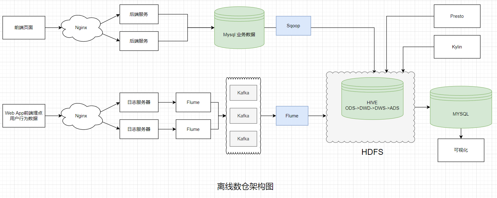

# 大数据离线数仓项目
>数据仓库：是为企业制定决策，提供数据支持，可以帮助企业，改进业务流程，提高产品质量。本项目将基于hive on spark对数据进行数据分析。

## 离线项目的架构图：

## 数仓分层
> 数据仓库，并不是数据的最终目的地，而是为数据最终的目的地做好准备，这些准备包含：备份，清洗，聚合，统计等。
* `ODS`: 用于存储原始数据。
* `DWD`: 可以做数据清洗。
* `DWS`: 大数据的应用场景中，比较慢的操作就是join操作，所以可以将join操作放到DWS层。可以按照天的维度将数据join到一起，形成多张大表。
* `DWT`: 累积形大表，方便我们后续的查询。
* `ADS`: 最终报表的数据来源。

## 项目需求
1. 用户行为数据采集平台搭建，使用flume实现。
2. 业务数据采集平台的搭建，使用sqoop将数据直接从mysql导入到hdfs上。
3. 数据仓库维度建模。
4. 分析设备，会员，商品，地区，活动等电商核心主题。
5. 采用即席查询工具，随时进行指标分析。使用kylin和presto
6. 对集群性能进行监控，发生异常需要报警。zabbix+grafana
7. 元数据管理：atlas,如果某一层出现问题，我们可以快速分析数据之间依赖关系。
8. 数据质量监控：写脚本对关键数据进行监控，如果数据异常，那就发出预警。
9. 权限管理：kerberos+ranger。
## 集群规划

| role             | bigdata01                                                               | bigdata02               | bigdata03                  |
|------------------|-------------------------------------------------------------------------|-------------------------|----------------------------|
| HDFS             | nameNode,dataNode                                                       | dataNode                | dataNode,secondaryNameNode |
| YARN             | nodeManager                                                             | ResourceManager         | nodeManager                |
| JobHistoryServer | jobHistoryServer                                                        |                         |                            |
| zookeeper        | zookeeper                                                               | zookeeper               | zookeeper                  |
| kafka            | kafka                                                                   | kafka                   | kafka                      |
| flume            | flume(file to kafka)                                                    | flume(file to kafka)    | flume(kafka to hdfs)       |
| mysql            | mysql                                                                   |                         |                            |
| maxwell          | maxwell                                                                 |                         |                            |
| hive             | hive                                                                    |                         |                            |
| DataX            | DataX                                                                   |                         |                            |
| Spark            | Spark                                                                   |                         |                            |
| DolphinScheduler | ApiApplicationServer,AlertServer,MasterServer,WorkerServer,LoggerServer | WorkServer,LoggerServer | WorkServer,LoggerServer    |
| SuperSet         | SuperSet                                                                |                         |                            |
|                  |                                                                         |                         |                            |

